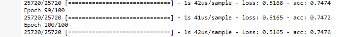
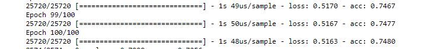
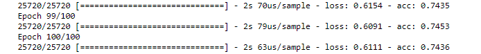
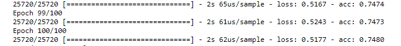
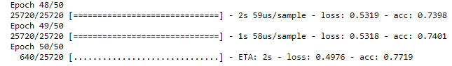

# Module-19-Challenge

## The purpose of this Challenge is to build your own machine learning model that will be able to predict the success of a venture paid by Alphabet soup and use different strategies on improving a model's performance.

1. Refer to the file AlphabetSoupChallenge.ipynb file. Exploring the data types in our dataframe by org_df.dtypes, we find out that most of the columns are with categorical values and four columns with numerical values - EIN, STATUS, ASK_AMT, IS_SUCCESSFUL. Therefore we had to convert data with object data type to numeric. 

2. Looking at the unique value counts, there are variables that appear frequently in the dataset, however, many of them appear semi-frequently and even rarely appear in the dataset. According to the nunique method, some of the categorical variables have more than 10 unique values, such as APPLICATION_TYPE, CLASSIFICATION, etc.
The OneHotEncoder has been used to produce encoded DataFrames for APPLICATION_TYPE, CLASSIFICATION, AFFILIATION, etc. With Pandas’ merge and drop methods
the original columns were replaced with encoded features.

3. ASK_AMT column contains 8747 different amounts. To group them there were eight bins created as following:  ['<10K', '10K-24.9K', '25K-99.9K', '100K-999.9K', '1M-4.9M', '5M-9.9M', '10M-49.9M', '50M+']. A new column ASK_AMT_Ranges has been created and then encoded. Columns with Status, ASK_AMT, NAME, EIN were dropped.

4. TensorFlow library is used and deep learning model structure is following:  two hidden layers with 200 and 96 neurons in first and second layer respectively. All of our hidden layers use the ReLU activation function to identify nonlinear characteristics from the input data and output layer has Sigmoid activation function.
The results of training epochs are shown below.

5. In order to improve the performance we are going to use Random Forest Classifier to rank the importance of input variables.
The most important features are 'AFFIL_2','AFFIL_1', 'ORG_Association' and the least important are 'SPEC_CONS_N', 'SPEC_CONS_Y', 'USE_Other'. After three least important features were eliminated the results almost have not changed.

6. Changing output layer activation finction from Sigmoid to ReLU made the resulting parameters worse, because model loss is deteriorating.

7. For this trial the columns with three other least important features - 'ORG_Corporation', 'USE_Heathcare', 'AFFIL_3' were removed. Again the performance metrics of the model almost have not changed.

8. The next trial is to add one more hidden layer, so we would have three layers and bigger numbers of neurons as following: hidden_nodes_layer1 = 384, hidden_nodes_layer2 = 192
hidden_nodes_layer3 = 96

9. Refer to the file ASC1.ipynb file. For a new attempt to improve the results of the model, a "numeric Name" column was created and unique names are assigned with unique numbers. It allowed us to keep the names of the organisatisations as one of the features of the input data. However this change did not bring better metrics.

Conclusion. The only change that made our performance metrics more acceptable was addition of one more hidden layer with increased number of neurons.
